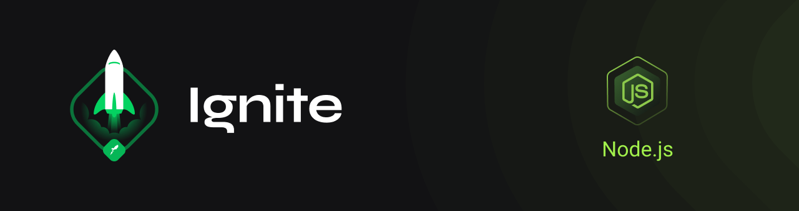

  

 

<h1 align="center">
  Iniciando a API
</h1>

<h2 align="center">
  API de aluguel de carros
</h2>

 

  
  
  

### Objetivos do módulo:
- Entender o que é o TypeScript;
- Entender como utilizar o TypeScript para melhorar uma aplicação;
- Entender os princípios do SOLID;
- Entender o que é a arquitetura limpa;
- Entender como documentar uma aplicação.

### Especificações:
- Cadastro de usuários;
- Cadastro de carros;
- Cadastro de aluguéis;
- Cadastro de especifições para busca do usuário.
